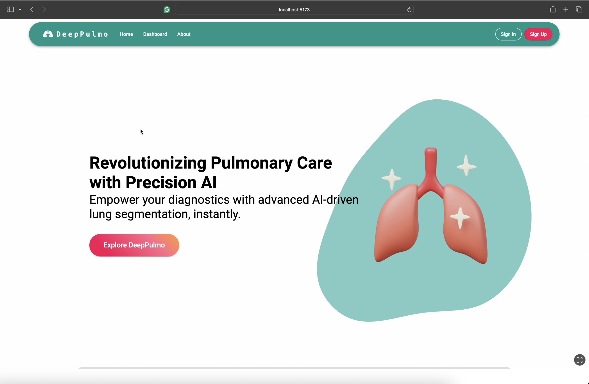
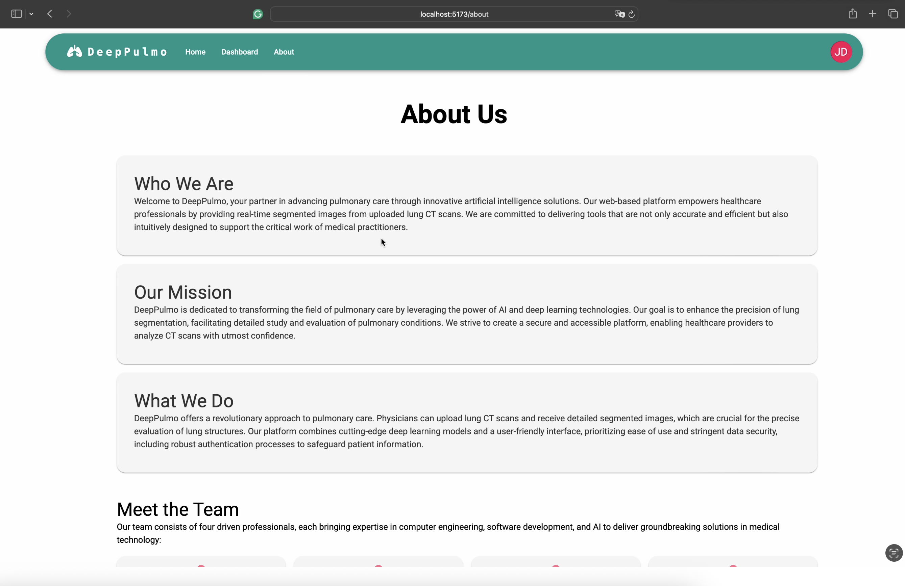
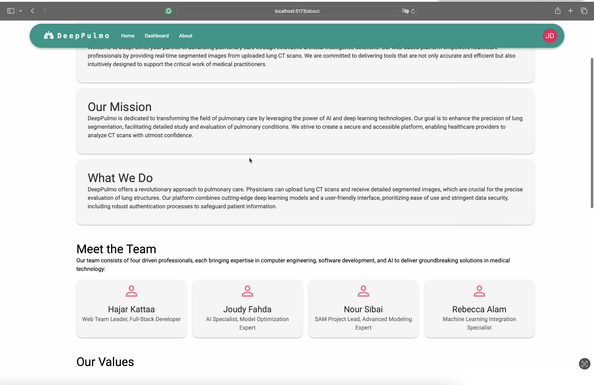
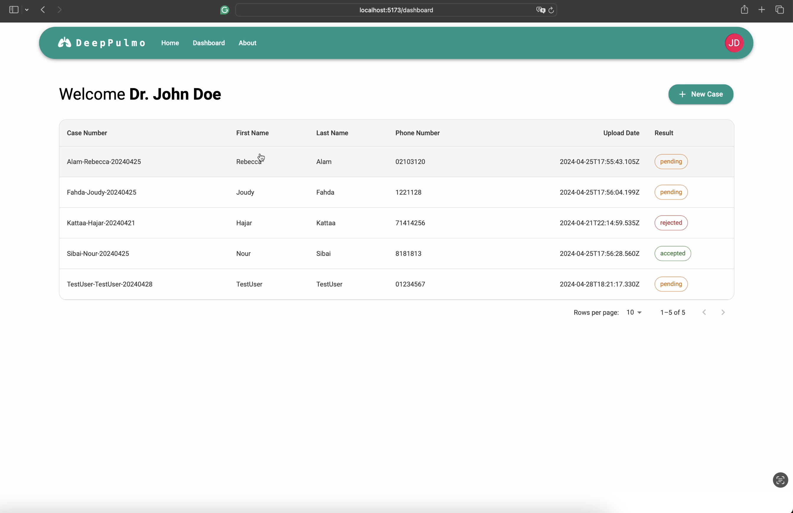
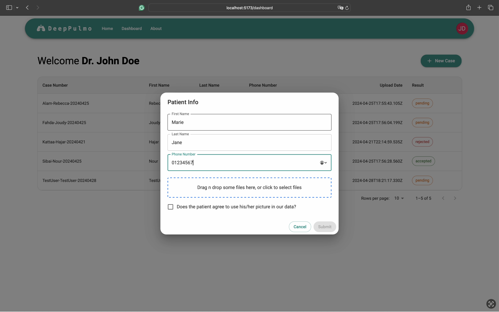
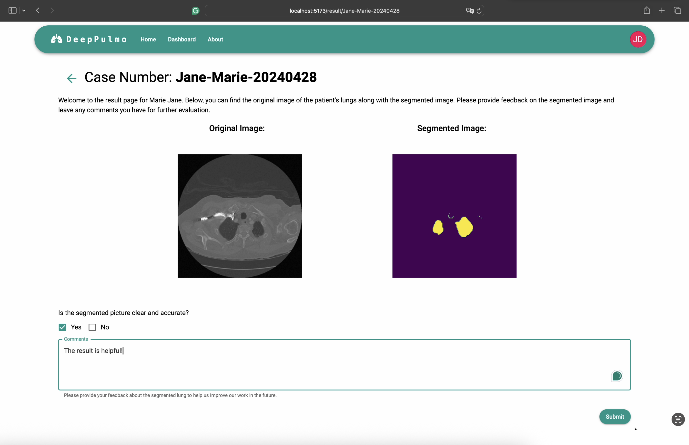
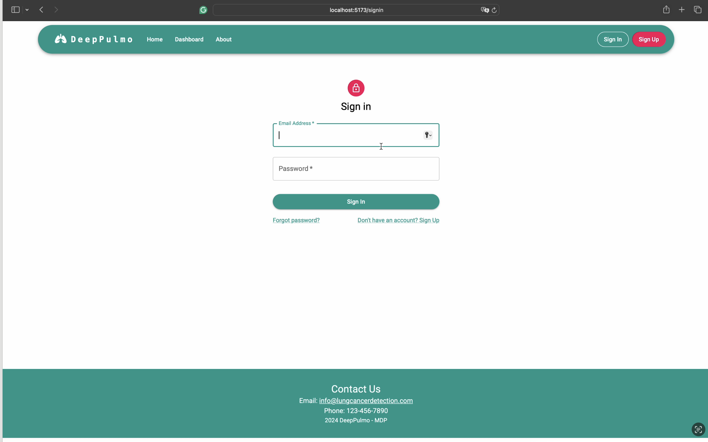
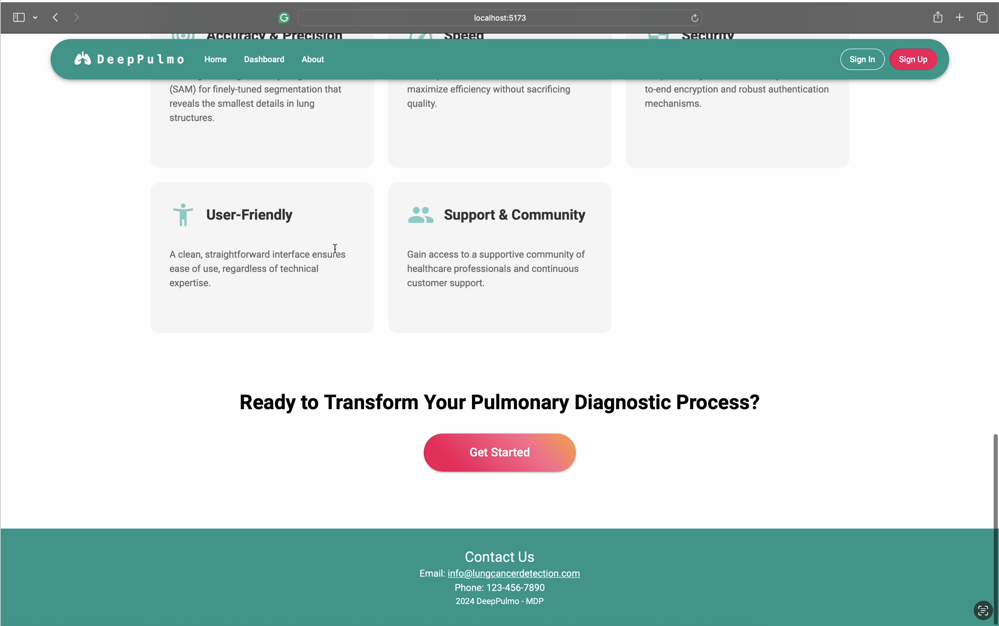

# MDP_31_2024
# Pulmonary Disease Detection Web Platform

A full-stack medical web application designed to assist in the detection of pulmonary diseases using machine learning on chest X-ray images. Built with the MERN stack, the platform enables users to upload medical images and receive prediction results from an integrated ML model.

## 🧠 Features

- ✅ Upload and analyze chest X-ray images
- ✅ View predictions and model confidence
- ✅ Secure user authentication and session handling
- ✅ Responsive and modern UI built with MUI and Ant Design
- ✅ RESTful API backend with Express and MongoDB

## 🛠 Tech Stack

### Frontend
- **React** (with Hooks)
- **Material-UI** (MUI)
- **Ant Design**

### Backend
- **Node.js** with **Express**
- **MongoDB** with **Mongoose**
- **JWT** for authentication
- **Multer** for image upload handling

### Machine Learning
- Pre-trained classification model integrated via API (e.g., TensorFlow/Keras/PyTorch)
- Inference on uploaded medical images

## 🚀 Getting Started

### Prerequisites

- Node.js ≥ 16
- Python 3.x (if ML model is served separately)

### Setup

1. **Clone the repo**  

2. **Install client dependencies**

4. **Environment Variables**

5. **Run the development server**

6. **Access the app**

   * Open `http://localhost:3000` in your browser

## 📊 Machine Learning Model

This project integrates a trained classification model to detect signs of pulmonary diseases. currently not in the project but seperated to a server project

## 📸 Screenshots

### 🏠 Homepage

### 📘 About Page – Introduction

### 📘 About Page – Team & Values

### 📊 Dashboard View

### ➕ New Case Modal

### 🖼️ Segmentation Result Page

### 🔐 Sign-In Page

### 📞 Footer Section

## 🧑‍💻 Authors

* Hajar (Lead Full-Stack Developer)

---

> For any inquiries or contributions, feel free to open an issue or submit a pull request!

